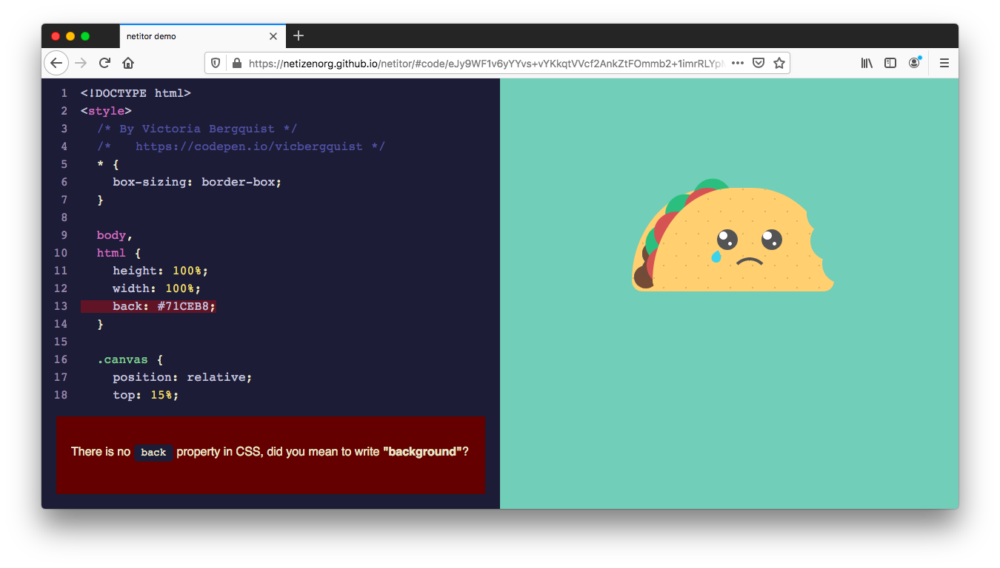

# netitor

[](https://standardjs.com)

A pedagogical web based code editor for creative netizens in training. You can play with a [live demo here](https://netizenorg.github.io/netitor/) (or for the example below [click here](https://netizenorg.github.io/netitor/#code/eJy9WF1v6yYYvs+vYKkqtVVcf2AnkZtFOmmb2+1imrRLYpMEHcdkNumaM+2/DxvsGIxj5xxtqvwRwM/78PDwAl389PbL629//PoO9uyQLEeLnJ0TvBwBYD+B1Rn8TiJGM4LACme7P08kZ+DJFrWAf8KOeWjbEY3xEafPhNofJNqoLZ/A3/wOwIZ+Wjn5RtJdyN+zGGcWL3rhdf+MRkV1fJ6MQElDfrHHZLdnIXAd5/6lLPmLxGzfLNig6Osuo6c0DsHdzH19X81rxOcIpR8ol2BHmhNGaBqCDCeIkQ8sEBg9csBA4h1QtiO8DTox+qKQgIFz/FRYNEqu0sj3OEkm9ZsV0eO5RQptcpqcmJGUgr5ev65njqwQMmYoJqc8BIFzX14uPhSXXcgExE2U6HAWOaAd5opwAJRYu+KJU/Zw97ZaeVMHBPcTwDKU5keU8XLgPE5uaNuKxkefB4NctfLWqr+o4QBnAtwZb1jcNCmldgnelt64V8fJ17wyq35/s0ga408OruE1BySTjvNuRg0uqAeMGL+TNMI941ybS4OHZn8H/goGXUOvlEtxuIA8HInBXeAXf0qbDWWMHpqtGuOn9WaAXT1fUpCx/ftBfWxJFqZsb0V7ksQP7mOdOwRVpxnBcvsRPB2h9ovAcPoAoA4AbwTwdQA/UHVqdiJHCYrBc4LR9jud4xmThrdarWfrq0mDTzl7yp9T8a5zGpKvNAPAnjk07ei5yQBlAF+VvpqjpWu3NOPaZpQhhh+sqRPj3WMfuqega86os68B3h8EDxV4Sx12CH8UvmWsmrFMYhbs7sKwEEGnd6sQ3mxwCA6AGMV59TbQ4LprzAZ/mwYwgNdSo0bilvV3oJ9nxkDy7VpWU+P4w1BU83pQwZgPw1AdqiRXKbOAwOfi86JicvlZWmCIjtDVhJurus1NA2pYr1prnWntFdx43AZToXMPVSX6drvt99JFFWVH4sNWm6ZUcuZAr9WKk76Wj/o2On6bm9Lxym2eo85hb64Bu9r4uPM2VYyyQVNI64QF9V4EWi8C484HfnmD71+MQzIv16sgKFcxu3g6ZVkNZEiwUEtNB3pi+z5/VClQnWl+S71AU6/OV4K3WMmubswkcte27CKBNEJ/Q6lVtb674uqYRaUkG8KGZcnaPpLN9EY92jtY81nKPN1LmmG4wXyA8aRRgrYMVxbtRBxywLySAJTgMlZEU8blD8F4LABikh8TdOZn3oRGX1/6BbVm2pxxDTGb3fuhkJWtrakatd6dL2z5H4HRIiYfIEpQnv88Fkfr8bLg1CwvD1Tj5cLmZUutrtgfj5dlDKW42DA3Pvnvao2syp2PgVaxFepE/n8qjXyr5dxAWVR1ot9abZarPjF3jHKxQBjl3FaDr4XlS4nCSWd1vFIr3Kt2ydy7MjuZCXx3BLPLi7WkQ5ty8tZ14vEvbE1oAg==).)



# How To

The [index.html](https://github.com/netizenorg/netitor/blob/master/index.html) in the root of the directory is a working example of how to implement the netitor. The first thing you need to do is instantiate a new instance of `Netitor`. The constructor requires an options object with query selector string of an element in your HTML page, like:

```js
// assuming there's something like a <div id="editor"></div> on your page
const ne = new Netitor({
  ele: '#editor'
})
```

there are a series of additional optional arguments you can pass.

```js
const ne = new Netitor({
  ele: '#editor',
  render: '#output',
  code: '<h1> example code here </h1>',
  theme: 'dark',
  background: true,
  language: 'html',
  lint: true,
  hint: true,
  autoUpdate: true,
  updateDelay: 500,
  friendlyErr: true
})
```

| property | default | description |
|:---:|:---:|:---:|
| render | none | query selector string of an element to display the realtime  code output in
| code | none | initial code to include in the editor
| theme | dark | syntax highlight theme to use
| background | true | if false, background will be transparent
| language | html | can be html, css or javascript
| lint | true | whether or not to check for errors in realtime
| hint | true | whether or not to display autocomplete menus
| autoUpdate | true | whether or not to update the render preview when code changes
| updateDelay | 500 | how many milliseconds to wait after code changes before preview updates
| friendlyErr | true | whether or not to translate default error messages into beginner friendly vernacular (when available)

## Properties

all of these options can be changed at any point by reassigning the property of the same name:

```js
ne.code = '<h1> some other code </h1>'
ne.theme = 'monokai' // or 'light' or 'dark'
ne.background = false
ne.language = 'css'
ne.lint = false
ne.hint = false
ne.autoUpdate = false
ne.updateDelay = 2000
ne.friendlyErr = false
```
### read-only properites

Netitor is a fully static web-based editor, as such it allows you to save and load code sketches to the URL (no database or back-end needed to save/share/remix/etc), in order to check if the current URL has a hash with code/data in it you can use `ne.hasCodeInHash`, this read-only property returns either `true` or `false`

You can check to see if the code in the editor is "tidy" (aka property formatted/indented) by calling `ne.isTidy`.

## Methods

**update()**: if the `autoUpdate` is set to `false` you can control when you want the preview window to update yourself by calling: `ne.update()`

**highlight(lineNumber, color)**: this method will highlight a line of code in the editor. It requires a number as it's first argument (the line you want to highlight) with a CSS color string as an optional second argument (the default color is a translucent red). To remove a highlight simply call the method with 0 as the first argument (ex: `ne.highlight(0)`).

**saveToHash()**: this method will take all the code currently in the editor and save an encoded/compressed version of it to the current site's URL hash.

**loadFromHash()**: if the current site's URL hash has encoded/compressed code in it (which you can check for using `ne.hasCodeInHash`) this will decode the URL and load the data into the editor.

**loadFromURL(url)**: if you have some example code saved online somewhere (with CORS enabled) this method will send a fetch request for that code and load it up in the editor.

**tidy()**: calling this method will clean-up (aka format) the code in the editor (fix spacing, indentation, etc).

**on('event-name', callbackFunction)**: the netitor has a l(still working on it)ist of events you can listen for and pass a callback function to, for example:

```js
ne.on('code-update', (event) => {
  // this function will run every time the code in the editor changes
})
```

### events

**code-update**: This fires every time the code in the netitor changes. The `data` passed into the callback function is a string containing all the code currently in the editor (essentially the same as `ne.code`)

**render-update**: This fires every time the render output iframe is updated.

**hint-select**: This fires every time the user tabs up or down in the autocomplete hinting menu with the up/down arrow keys. The data object passed into the callback function contains the language of and the autocomplete option currently selected, an example might look like this:
```js
{
  language: "css",
  data: "color"
}
```

**lint-error**: Assuming you have `lint` set to `true`, if/when there are any errors in the netitor this callback will fire. The callback gets passed an array of error objects. These error objects vary a bit between languages but will all have at the very least the following properties:
```js
{
  type: "error", // or "warning"
  message: "traditional error message in programmer lingo",
  friendly: "beginner friendly error message",
  line: 6, // line where the error was found
  col: 3 // column where the error was found
}
```

**edu-info**: Anytime you double-click on a piece of code in the netitor this callback will fire. The data object passed into the callback function will at the very least look this:
```js
{
  language: "html",
  data: "class",
  type: "attribute",
  nfo: {…}
}
```
The `nfo` property will contain an object with educational/reference information as well as links to further resources on that particular piece of code. This may not always be available, it depends on whether the particular piece of code selected has additional info. This info is generated from our [eduscraper](https://github.com/netizenorg/eduscraper) you can take a look at that repo to get a sense of the structure of the data.
